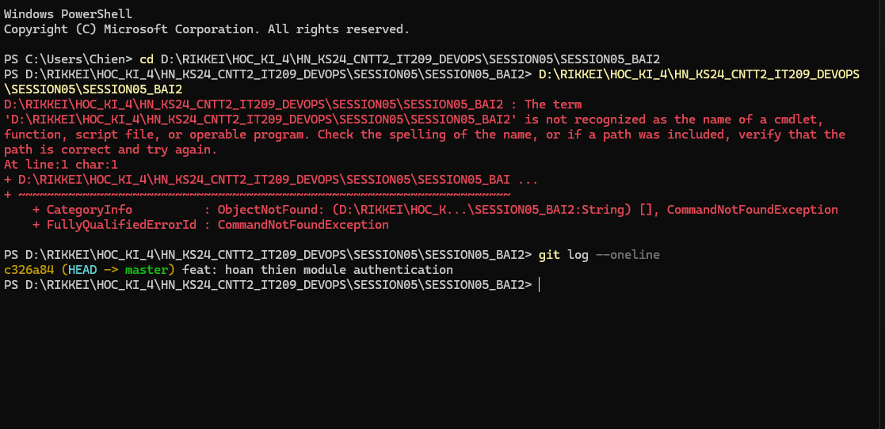

# Báo Cáo Bài 2: Tái Cấu Trúc Lịch Sử Commit Bằng Interactive Rebase

## 1. Thông Tin Học Viên
- **Bài tập:** Bài 2 - Tái cấu trúc lịch sử commit bằng Interactive Rebase
- **Học phần:** IT209 - DevOps / Git & Version Control (Session 05)
- **Đường dẫn nộp bài:** `homework/session_05/ex2/`

---

## 2. Mục Tiêu Bài Tập
1. Sử dụng công cụ tương tác **Interactive Rebase** (`git rebase -i`) để tái cấu trúc lịch sử commit cục bộ.
2. Gộp 3 commit nhỏ lẻ (`feat: khoi tao module auth`, `fix typo`, `adds utility functions`) thành 1 commit duy nhất (**squash**).
3. Đổi thông điệp commit sau khi gộp thành: `feat: hoan thien module authentication`.
4. Xóa bỏ hoàn toàn commit thử nghiệm chứa file rác `temp.txt` (**drop**).
5. Đảm bảo lịch sử commit sạch sẽ trước khi đẩy lên remote repo.

---

## 3. Quá Trình Thực Hiện

### Bước 1: Khởi tạo dữ liệu và 4 commit giả lập
Ban đầu trên nhánh `master`, có 4 commit được tạo lần lượt:
```text
332006b (HEAD -> master) add temp file for debug
4f0dabe adds utility functions
9c34f3c fix typo
b39c867 feat: khoi tao module auth
```

### Bước 2: Chạy lệnh Interactive Rebase
Vì cần can thiệp từ commit đầu tiên (root commit), thực hiện lệnh:
```bash
git rebase -i --root
```

### Bước 3: Cấu hình Interactive Rebase (Pick / Squash / Drop)
Trong màn hình soạn thảo danh sách commit của Git, cấu hình lại các hành động:
```text
pick b39c867 feat: khoi tao module auth
squash 9c34f3c fix typo
squash 4f0dabe adds utility functions
drop 332006b add temp file for debug
```

*Giải thích cấu hình:*
- `pick`: Giữ lại commit đầu tiên làm commit nền tảng.
- `squash` (hoặc `s`): Gộp các commit `fix typo` và `adds utility functions` vào commit nền tảng phía trước.
- `drop` (hoặc `d`): Loại bỏ hoàn toàn commit `add temp file for debug` cùng file rác `temp.txt`.

> 📷 **Cấu hình Interactive Rebase:**
> Đã cấu hình thành công danh sách commit với `pick`, `squash` và `drop` theo đúng kịch bản yêu cầu.

### Bước 4: Chỉnh sửa thông điệp commit
Khi Git mở cửa sổ gộp thông điệp commit, toàn bộ các thông điệp cũ được thay thế bằng thông điệp duy nhất:
```text
feat: hoan thien module authentication
```

---

## 4. Kết Quả Sau Khi Rebase

### 4.1. Kiểm tra lịch sử commit
Chạy lệnh kiểm tra:
```bash
git log --oneline
```
**Kết quả thực tế:**
```text
c326a84 (HEAD -> master) feat: hoan thien module authentication
```

> 📷 **Ảnh chụp màn hình kết quả Git Log:**
>
> 

### 4.2. Kiểm tra trạng thái thư mục làm việc
Chạy lệnh kiểm tra file trong thư mục:
```powershell
Get-ChildItem
```
- File `auth.js`: Được giữ lại đầy đủ nội dung hoàn chỉnh (`function login(user, pass) { return true; } function logout() {}`).
- File `temp.txt`: Đã bị xóa bỏ hoàn toàn khỏi cây thư mục và lịch sử Git.
- Working tree ở trạng thái sạch sẽ (`working tree clean`).

---

## 5. Kết Luận
- Quá trình Interactive Rebase thành công 100%.
- Lịch sử Git đã được tinh chỉnh gọn gàng, có tính bao quát và sẵn sàng để push lên remote repository theo chuẩn quy trình Git Flow / GitHub Flow chuyên nghiệp.
